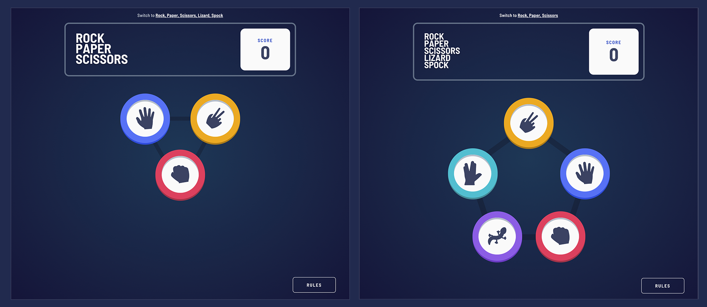
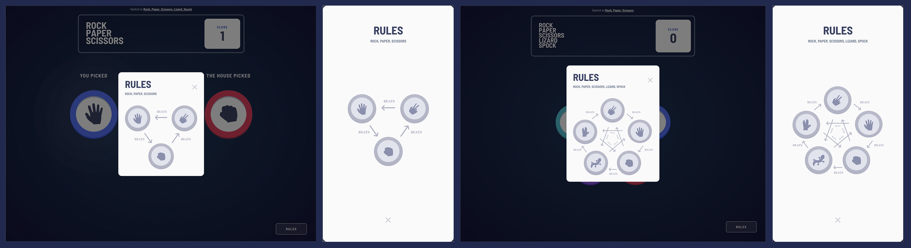
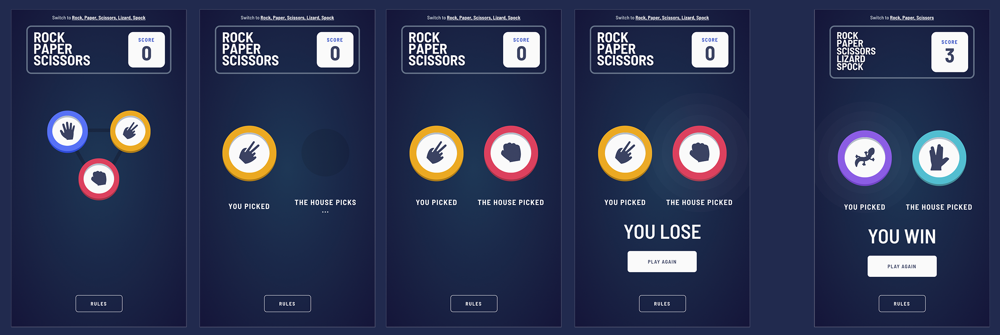

# Frontend Mentor - Rock, paper, scissors, lizard, spock solution

This is a solution to the [Rock, Paper, Scissors challenge on Frontend Mentor](https://www.frontendmentor.io/challenges/rock-paper-scissors-game-pTgwgvgH). Frontend Mentor challenges help you improve your coding skills by building realistic projects.

## Overview

### The challenge

Users should be able to:

-   View the optimal layout for the game depending on device screen size
-   Play Rock, Paper, Scissors against the computer
-   Bonus: Play Rock, Paper, Scissors, Lizard, Spock against the computer

### Screenshots

#### Desktop

#### Rules

#### Mobile + game flow

#### Mobile

### Live deployment preview

[rock-paper-scissors-nosthrillz.vercel.app](https://rock-paper-scissors-nosthrillz.vercel.app)

## My process

### Built with

- React.js with context
- SCSS
- CSS in JS: styled-components
- styled-react-modal

### What I learned

I needed to practice styled-components and this project was great for that. I also finally managed to create a nice context without having to search for anything :)

### Continued development

I need to refactor to simplify the code and maybe potentially storing the state in local storage, so you can keep your scores.